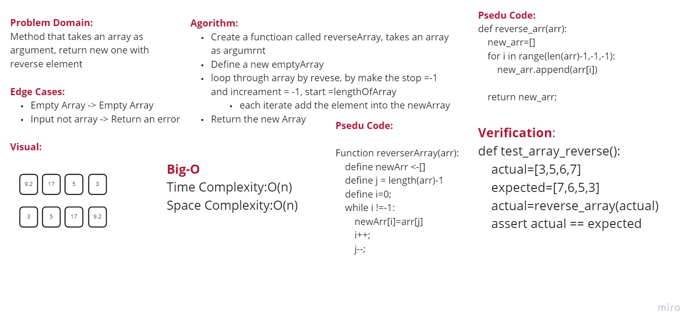
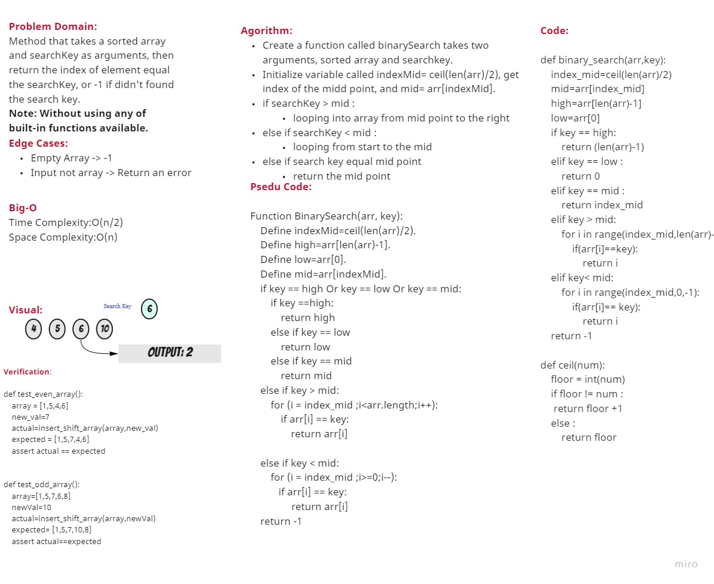
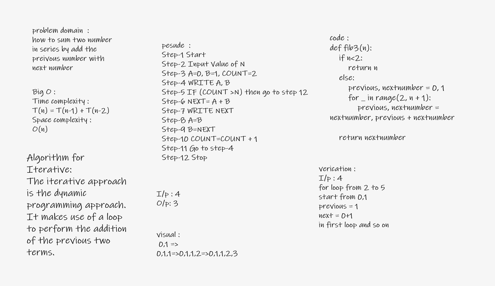
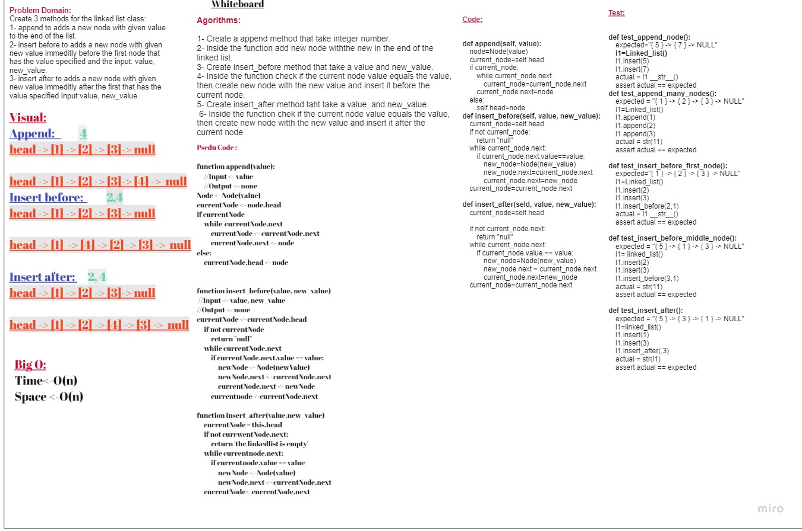
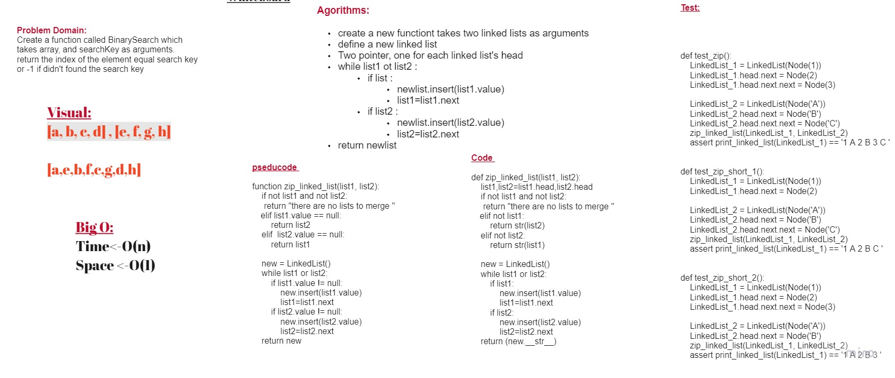
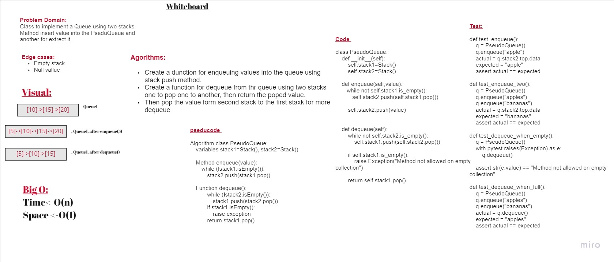
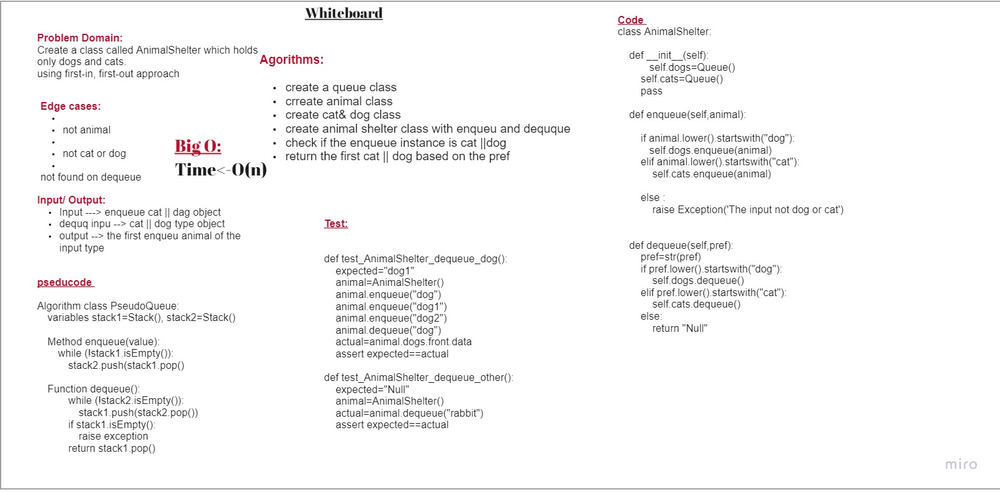
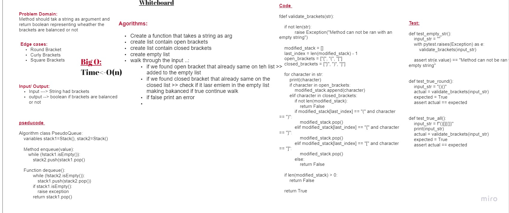
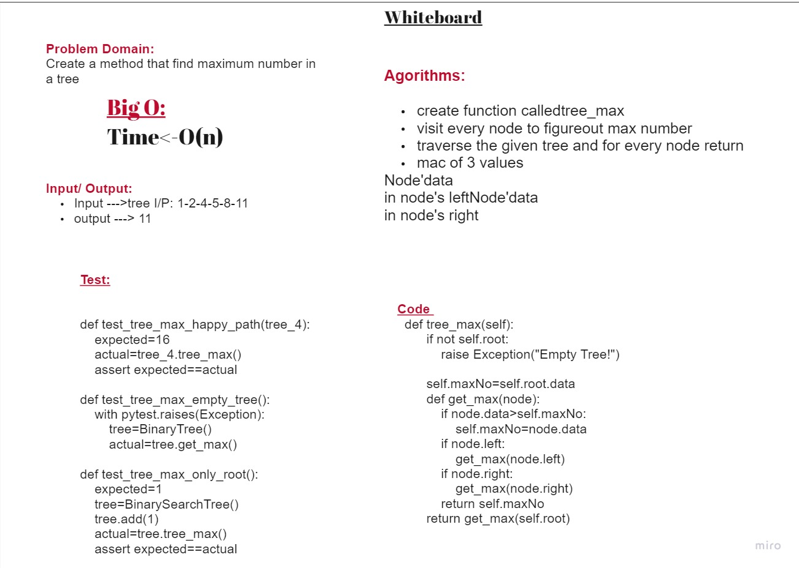
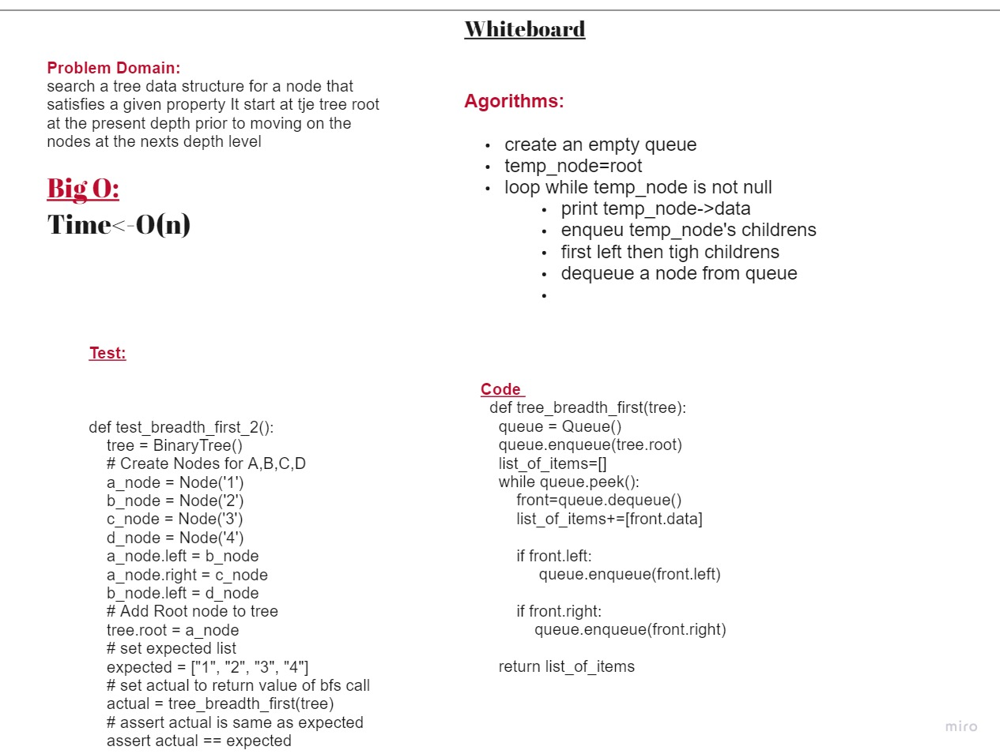

# Data Structure & Algorithms

## Overview

This repository will include some challenges are related to data structure & algorithms

## Table Of Content

- [Data Structure & Algorithms](#data-structure--algorithms)
  - [Overview](#overview)
  - [Table Of Content](#table-of-content)
  - [Challenges](#challenges)
    - [Challenege 1 - Reverse Array](#challenege-1---reverse-array)
      - [Challenge](#challenge)
      - [Solution](#solution)
      - [Whiteboard](#whiteboard)
    - [Challenge 2 - Insert and Shift Array](#challenge-2---insert-and-shift-array)
      - [Challenge](#challenge-1)
      - [Solution](#solution-1)
      - [Whiteboard](#whiteboard-1)
    - [Challenege 3 - Array Binary Search](#challenege-3---array-binary-search)
      - [Challenge](#challenge-2)
      - [Solution](#solution-2)
      - [Whiteboard](#whiteboard-2)
    - [Challenege 4 - Interview](#challenege-4---interview)
      - [Challenge](#challenge-3)
      - [Solution](#solution-3)
      - [Whiteboard](#whiteboard-3)
    - [Challenege 5 - Linked-list](#challenege-5---linked-list)
      - [Challenge](#challenge-4)
      - [Solution](#solution-4)
      - [Whiteboard](#whiteboard-4)
    - [Challenge 6 - LinkedList - Append,Insert before, Insert After](#challenge-6---linkedlist---appendinsert-before-insert-after)
      - [Challenge](#challenge-5)
      - [Solution](#solution-5)
      - [Whiteboard](#whiteboard-5)
    - [Challenege 7 - LinkedList - kth from end](#challenege-7---linkedlist---kth-from-end)
      - [Challenge](#challenge-6)
      - [Solution](#solution-6)
      - [Whiteboard](#whiteboard-6)
    - [Challenge 8 - Linkedlist - Zip](#challenge-8---linkedlist---zip)
      - [Challenge](#challenge-7)
      - [Solution](#solution-7)
      - [Whiteboard](#whiteboard-7)
    - [Challenge 10 - Stack and Queue Implementation](#challenge-10---stack-and-queue-implementation)
      - [Challenge](#challenge-8)
      - [Solution](#solution-8)
      - [Whiteboard](#whiteboard-8)
    - [Challenge 11 - Stack Queue Pseudo](#challenge-11---stack-queue-pseudo)
      - [Challenge](#challenge-9)
      - [Solution](#solution-9)
      - [Whiteboard](#whiteboard-9)
    - [Challenge 12- Animal Shelter](#challenge-12--animal-shelter)
      - [Challenge](#challenge-10)
      - [Solution](#solution-10)
      - [Whiteboard](#whiteboard-10)
    - [Challenge 13 - Stack Queue bracketss](#challenge-13---stack-queue-bracketss)
      - [Challenge](#challenge-11)
      - [Solution](#solution-11)
      - [Whiteboard](#whiteboard-11)
    - [Challenge 15 - Trees](#challenge-15---trees)
      - [Challenge](#challenge-12)
      - [Solution](#solution-12)
      - [Whiteboard](#whiteboard-12)
    - [Challenge 16 - Trees-max](#challenge-16---trees-max)
      - [Challenge](#challenge-13)
      - [Solution](#solution-13)
      - [Whiteboard](#whiteboard-13)
    - [Challenge 17 - Trees- breadth first](#challenge-17---trees--breadth-first)
      - [Challenge](#challenge-14)
      - [Solution](#solution-14)
      - [Whiteboard](#whiteboard-14)

## Challenges

Table of Challenges

### Challenege 1 - Reverse Array

#### Challenge

Write a function called reverseArray which takes an array as an argument. Without utilizing any of the built-in methods available to your language, return the provided array argument with elements in reversed order.

---

#### Solution

*[The Sol:](./array_reverse/README.md)*

---

#### Whiteboard



---

### Challenge 2 - Insert and Shift Array

#### Challenge

Write a function called ```insertShiftArray``` which takes in an array and the value to be added.
Without utilizing any of the built-in methods available to your language, return an array with the new value added at the middle index.

---

#### Solution

*[The Sol:](./array_insert_shift/README.md)*

---

#### Whiteboard


---

### Challenege 3 - Array Binary Search

#### Challenge

A function called `binary_search`
 which takes 2 parameters:

- first is a sorted array
- the second is the search key.

Return the index of the array's element that is equal to the value of the search key
     or -1 if the element is not in the array.

---

#### Solution

*[The Sol:](./array_binary_search/README.md)*

#### Whiteboard



---

### Challenege 4 - Interview

#### Challenge

how to sum two numbers in series by adding the previous number with the next number

---

#### Solution

[The challenge](./interview/README.md)

---

#### Whiteboard

W

---


### Challenege 5 - Linked-list

#### Challenge

How to use LinkedList to insert elements and check if it is exists or not

---

#### Solution

*[The Sol:](./linked_list/README.md)*

---

#### Whiteboard

> There is no whiteboard for this solution.

---

### Challenge 6 - LinkedList - Append,Insert before, Insert After

#### Challenge

Write methods that append a node to the end of the link list, insert a new node before a specific value, and insert a new node after a specific value.

- `.append(value)` which adds a new node with the given `value` to the end of the list

- `.insertBefore(value, newVal)` which add a new node with the given `newValue` immediately before the first `value` node

- `.insertAfter(value, newVal)` which add a new node with the given newValue immediately after the first value node

---

#### Solution

*[The Sol:](./linked_list_insertion/README.md)*

---

#### Whiteboard



---

### Challenege 7 - LinkedList - kth from end

---

#### Challenge

Create a  function that returns the node's value that is k places for the tail of the linked list.

---

#### Solution

*[The Sol:](./linked_list_kth/README.md)*

#### Whiteboard

*

---

### Challenge 8 - Linkedlist - Zip

#### Challenge

Write a function called Zip Linkedlists which takes two linked lists as arguments. Zip the two linked lists together into one so that the nodes alternate between the two lists and return a reference to the head of the zipped list.

---

#### Solution

*[**The Solution**](./linked_list_zip/README.md)*

---

#### Whiteboard

*

### Challenge 10 - Stack and Queue Implementation

#### Challenge

Implement both Stack and a Queue

---

#### Solution

*[**The Solution**](./stack_and_queue/README.md)

---

#### Whiteboard

**There are no whiteboard for this solution**


### Challenge 11 - Stack Queue Pseudo

#### Challenge

Implement a Queue using two Stacks.

---

#### Solution

[*The solution*](./stack_queue_pseudo/README.md)

---

#### Whiteboard

.

### Challenge 12- Animal Shelter

#### Challenge


---

#### Solution

[*The solution*](./stack_queue_animal_shelter/README.md)

---

#### Whiteboard




### Challenge 13 - Stack Queue bracketss

#### Challenge

this challenge is trying to let you get many solutions for 'multi_bracket_validation' .. then get the least complicated one..
somehow 'getting the Big O Notation'..!
it was fun and cool to try it :)

---

#### Solution

[*The solution*](./stack_queue_brackets/README.md)

---

#### Whiteboard




### Challenge 15 - Trees

#### Challenge

Implement a Trees

---

#### Solution

[*The solution*](./trees/README.md)

---

#### Whiteboard

**There are no whiteboard for this solution**

### Challenge 16 - Trees-max

#### Challenge

Find the maximum value stored in the tree

---

#### Solution

[*The solution*](./trees/README_Tree_max.md)

---

#### Whiteboard



### Challenge 17 - Trees- breadth first

#### Challenge

return the tree in breadth-first Traversal

---

#### Solution

[*The solution*](./trees/README_TREE_BREADTH_FIRST.md)

---

#### Whiteboard


