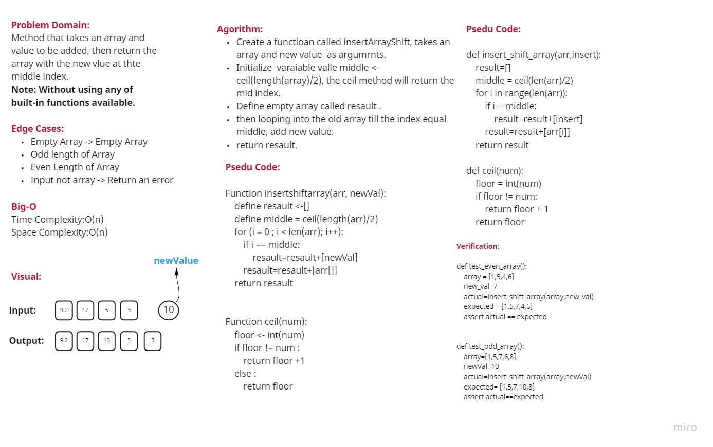
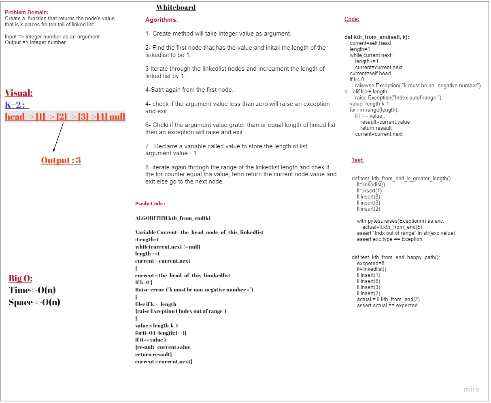
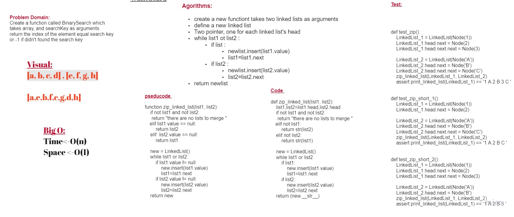
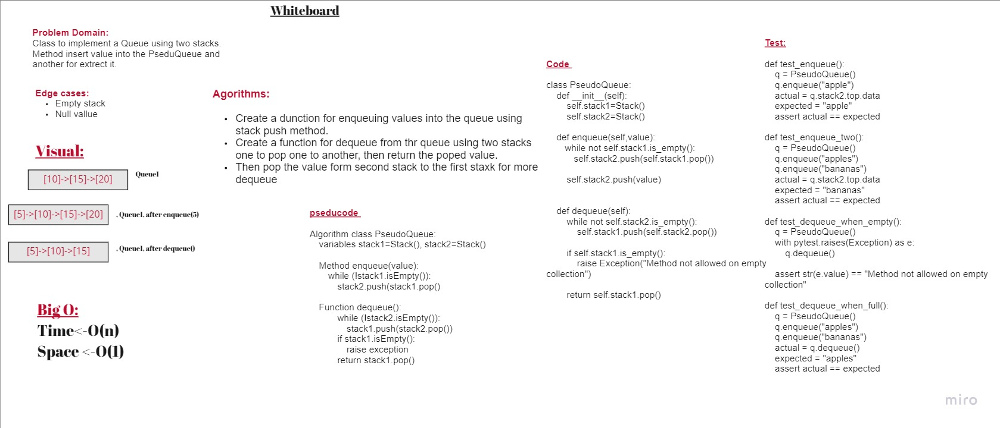

# Data Structure & Algorithms

## Overview

This repository will include some challenges are related to data structure & algorithms

## Table Of Content

- [Data Structure & Algorithms](#data-structure--algorithms)
  - [Overview](#overview)
  - [Table Of Content](#table-of-content)
  - [Challeneges](#challeneges)
    - [Array Challenges](#array-challenges)
      - [Challenege 1 - Reverse Array](#challenege-1---reverse-array)
        - [Challenge](#challenge)
        - [Solution](#solution)
        - [Whiteboard](#whiteboard)
      - [Challenge 2 - Insert and Shift Array](#challenge-2---insert-and-shift-array)
        - [Challenge](#challenge-1)
        - [Solution](#solution-1)
        - [Whiteboard](#whiteboard-1)
      - [Challenege 3 - Array Binary Search](#challenege-3---array-binary-search)
        - [Challenge](#challenge-2)
        - [Solution](#solution-2)
        - [Whiteboard](#whiteboard-2)
      - [Challenege 5 - Linked-list](#challenege-5---linked-list)
        - [Challenge](#challenge-3)
        - [Solution](#solution-3)
        - [Whiteboard](#whiteboard-3)
      - [Challenge 6 - LinkedList - Append,Insert before, Insert After](#challenge-6---linkedlist---appendinsert-before-insert-after)
        - [Challenge](#challenge-4)
        - [Solution](#solution-4)
        - [Whiteboard](#whiteboard-4)
      - [Challenege 7 - LinkedList - kth from end](#challenege-7---linkedlist---kth-from-end)
        - [Challenge](#challenge-5)
        - [Solution](#solution-5)
        - [Whiteboard](#whiteboard-5)
      - [Challenge 8 - Linkedlist - Zip](#challenge-8---linkedlist---zip)
        - [Challenge](#challenge-6)
        - [Solution](#solution-6)
        - [Whiteboard](#whiteboard-6)
      - [Challenge 10 - Stack and Queue Implementation](#challenge-10---stack-and-queue-implementation)
        - [Challenge](#challenge-7)
        - [Solution](#solution-7)
        - [Whiteboard](#whiteboard-7)
      - [Challenge 11 - Stack Queue Pseudo](#challenge-11---stack-queue-pseudo)
        - [Challenge](#challenge-8)
        - [Solution](#solution-8)
        - [Whiteboard](#whiteboard-8)

## Challeneges

Table of Challenges sorted by type

### Array Challenges

#### Challenege 1 - Reverse Array

##### Challenge

Write a function called reverseArray which takes an array as an argument. Without utilizing any of the built-in methods available to your language, return the provided array argument with elements in reversed order.

---

##### Solution

*[The Sol:](./array/array-reverse/README.md)*

---

##### Whiteboard


---

#### Challenge 2 - Insert and Shift Array

##### Challenge

Write a function called ```insertShiftArray``` which takes in an array and the value to be added.
Without utilizing any of the built-in methods available to your language, return an array with the new value added at the middle index.

---

##### Solution

*[The Sol:](./array/array-insert-shift/README.md)*

---

##### Whiteboard



---

#### Challenege 3 - Array Binary Search

##### Challenge

A function called `binary_search`
 which takes 2 parameters:

- first is a sorted array
- the second is the search key.

Return the index of the array’s element that is equal to the value of the search key
     or -1 if the element is not in the array.

---

##### Solution

*[The Sol:](./array/array-binary-search/README.md)*

##### Whiteboard


---

#### Challenege 5 - Linked-list

##### Challenge

How to use LinkedList to insert elements and check if it is exist or not

---

##### Solution

*[The Sol:](./LinkedList/linkedlist/)*

---

##### Whiteboard

> There is no whiteboard for this solution.

---

#### Challenge 6 - LinkedList - Append,Insert before, Insert After

##### Challenge

Write methods that append a node to the end of the link list, insert a new node before a specific value, and one that inserts a new node after a specific value.

- `.append(value)` which adds a new node with the given `value` to the end of the list

- `.insertBefore(value, newVal)` which add a new node with the given `newValue` immediately before the first `value` node

- `.insertAfter(value, newVal)` which add a new node with the given newValue immediately after the first value node

---

##### Solution

*[The Sol:](./LinkedList/linked-list-insertion/README.md)*

---

##### Whiteboard


---

#### Challenege 7 - LinkedList - kth from end

---

##### Challenge

Create a  function that returns the node's value that is k places fro teh tail of linked list.

---

##### Solution

*[The Sol:](./LinkedList/linked-list-kth/README.md))*

##### Whiteboard



---

#### Challenge 8 - Linkedlist - Zip

##### Challenge

Write a function called Zip Linkedlists which takes two linked lists as arguments. Zip the two linked lists together into one so that the nodes alternate between the two lists and return a reference to the head of the zipped list.

---

##### Solution

*[**The Solution**](./LinkedList/linked-list-zip/README.md)

---

##### Whiteboard



#### Challenge 10 - Stack and Queue Implementation

##### Challenge

Implement both Stack and a Queue

---

##### Solution 

*[**The Solution**](./stack_and_queue/)

---

##### Whiteboard

**There are no whiteboard for this solution**


#### Challenge 11 - Stack Queue Pseudo

##### Challenge 

Implement a Queue using two Stacks.

---

##### Solution 

[*The solution*](./stack_and_queue/stack_queue_pseudo/README.md)

---

##### Whiteboard

