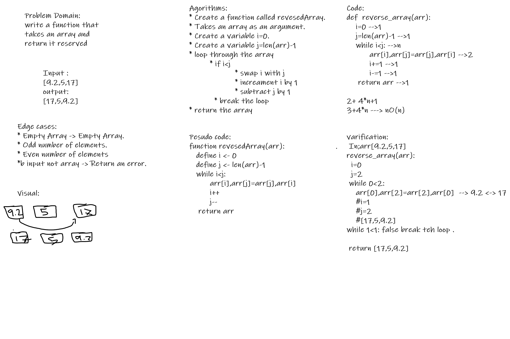
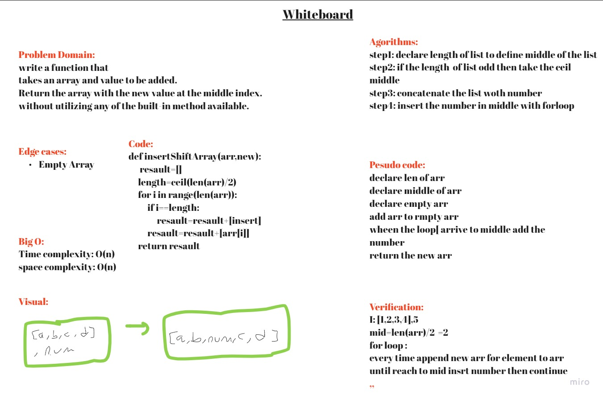
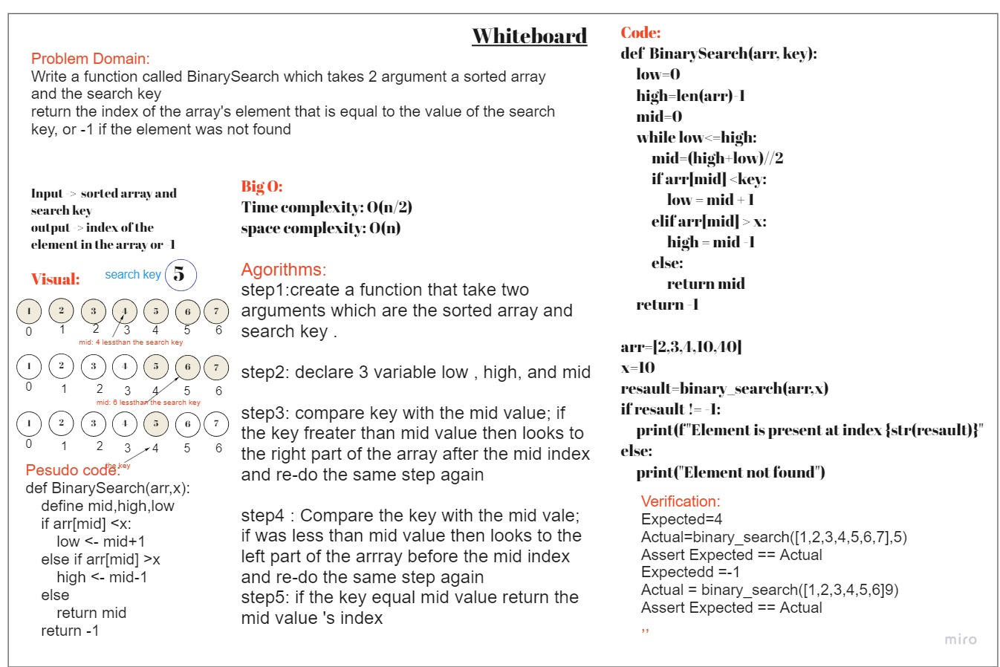
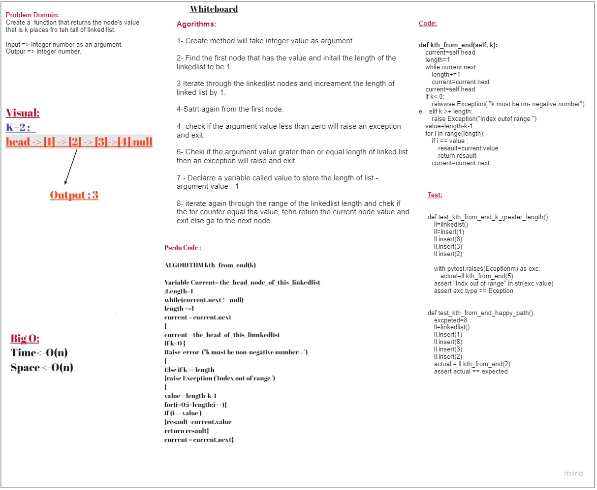

# Data Structure & Algorithms

## Overview

This repository will include some challenges are related to data-structure & algorithms

### Table Of Content
  
- [Data Structure & Algorithms](#data-structure--algorithms)
 
  - [Overview](#overview)
  
  - [Table Of Content](#table-of-content)
  - [Challenege 1 - Reverse Array](#challenege-1---reverse-array)
    - [Challenge](#challenge)
    - [Solution](#solution)
  - [Challenege 2 - Insert and Shift Array](#challenege-2---insert-and-shift-array)
    - [Challenge](#challenge-1)
    - [Solution](#solution-1)
  - [Challenege 3 - Array Binary Search](#challenege-3---array-binary-search)
    - [Challenge](#challenge-2)
    - [Solution](#solution-2)
  - [Challenege 5 - Linked-list](#challenege-5---linked-list)
    - [Challenge](#challenge-3)
    - [Solution](#solution-3)
  - [Challenege 6 - LinkedList - Append,Insert before, Insert After](#challenege-6---linkedlist---appendinsert-before-insert-after)
    - [Challenge](#challenge-4)
    - [Solution](#solution-4)
  - [Challenege 7 - LinkedList - kth from end](#challenege-7---linkedlist---kth-from-end)
    - [Challenge](#challenge-5)
    - [Solution](#solution-5)

=====================

<a id="reverse-array"></a>

### Challenege 1 - Reverse Array

#### Challenge

Write a function called reverseArray which takes an array as an argument. Without utilizing any of the built-in methods available to your language, return the provided array argument with elements in reversed order.

#### Solution

*[The Sol:](/array-reverse/README.md)*



<a id="insert-shift-array"></a>

### Challenege 2 - Insert and Shift Array

#### Challenge

Write a function called ```insertShiftArray``` which takes in an array and the value to be added. Without utilizing any of the built-in methods available to your language, return an array with the new value added at the middle index.

#### Solution

*[The Sol:](/array-insert-shift/README.md)*

  >

---

<a id="array-binary-search"></a>

### Challenege 3 - Array Binary Search

#### Challenge

Function called `binary_search`
 which takes 2 parameters:

- first is a sorted array
- second is the search key.

Return the index of the array’s element that is equal to the value of the search key
     or -1 if the element is not in the array.
---

#### Solution

*[The Sol:](./array-binary-search/README.md)*

  >

---

<a id="linked-list-insertion"></a>

## Challenege 5 - Linked-list

how to used linkedlist ot inser element and check if is exist or not

---

#### Solution

*[The Sol:](./linked-list/README.md)*

> There are no whiteboard for this solution.

---

## Challenege 6 - LinkedList - Append,Insert before, Insert After

---

#### Challenege
Write methods that appends an node to the end of the link list, inserts a new node before a specific value and one that inserts a new node after a specific value.

- `.append(value)` which adds a new node with the given `value` to the end of the list

- `.insertBefore(value, newVal)` which add a new node with the given `newValue` immediately before the first `value` node

- `.insertAfter(value, newVal)` which add a new node with the given newValue immediately after the first value node

---

### Solution

*[The Sol:](./linked-list-insertion/README.md)*

  >

---

## Challenege 7 - LinkedList - kth from end

---

#### Challenege
Create a  function that returns the node's value that is k places fro teh tail of linked list.

---

#### Solution

*[The Sol:](./linkedlist-kth/README.md)*

  >

---
