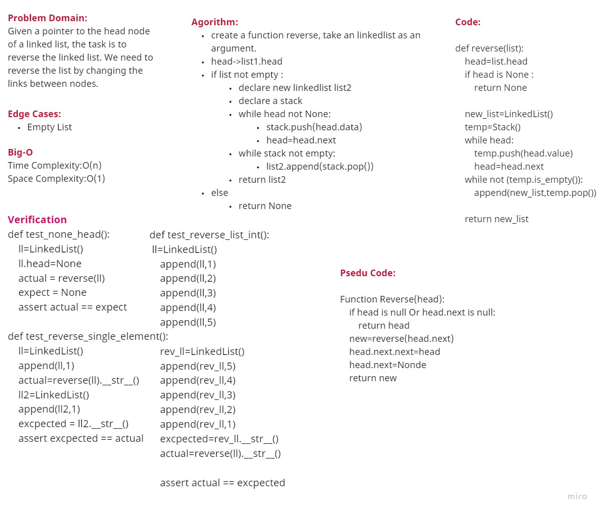

# Reverse LinkedList

## Problem Domain 

Given a pointer to the head node of a linked list, the task is to reverse the linked list. We need to reverse the list by changing the links between nodes.

---

## InterView

[**Excel-Sheet**](https://docs.google.com/spreadsheets/d/1dlurcaUAgg2Rctrdrc5f2Dl39K37ko_AyepDTMnu22g/edit?usp=sharing)

---

## Whiteboard

---

## Approach
 
 takes O(n) time to access an element, where n is the length of the linked list.
 
 ---
