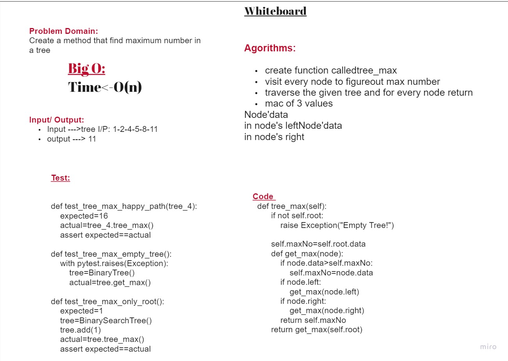

# Challenge 

Find the maximum value stored in the tree

## Whiteboard Process

## Approach & Efficiency

I use helper function inside the get-max method to do the recaerssion staff and finding the max number

time : O(n)
space : O(1)
